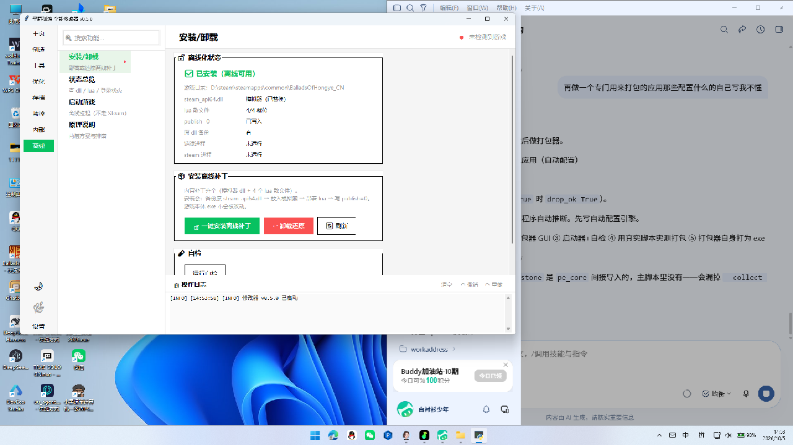

# 平野孤鸿 全能修改器 woldvein Trainer v0.5.0

> 📌 **版本沿革**：本版本承接自 **[woldvein Trainer v0.2](https://github.com/180lisilence/woldvein0.2)**（已归档，仅供查阅历史）

> 🆕 **v0.5.0**：新增侧边栏「🔓 离线」—— 内置 Steam 模拟器 + Lua 登录短路补丁，
> 一键安装即可免 Steam、免服务器验证启动游戏，随时可卸载还原，游戏 exe 不做任何修改。
> 同时修复 v0.4.9 遗留的导航索引错位（点「优化」弹出存档面板）。

> 专为西山居城建经营游戏《平野孤鸿》(BalladsOfHongye, Steam AppID 2656540) 开发的游戏修改工具。
>
> 纯内存操作 · DLL 注入 · Lua 执行引擎 · 微信三栏布局（左侧导航+中间列表+右侧面板） · 12 个全局热键 · 深/浅主题 GUI

---

## 目录

- [软件简介](#软件简介)
- [功能大全](#功能大全)
  - [资源修改](#1-资源修改)
  - [创造模式](#2-创造模式)
  - [热键配置](#3-热键配置独立工具)
  - [游戏监控](#4-游戏监控)
  - [高级工具](#5-高级工具)
  - [世界系统](#6-世界系统)
  - [应用设置](#7-应用设置)
- [快速开始](#快速开始)
- [热键大全](#热键大全)
- [技术架构详解](#技术架构详解)
  - [整体架构](#整体架构)
  - [DLL 注入机制](#dll-注入机制)
  - [Inline-Hook 原理](#inline-hook-原理)
  - [命令文件通信协议](#命令文件通信协议)
  - [创造模式实现原理](#创造模式实现原理)
- [项目结构详解](#项目结构详解)
- [源码运行指南](#源码运行指南)
- [编译 DLL 指南](#编译-dll-指南)
- [打包 EXE 指南](#打包-exe-指南)
- [配置文件说明](#配置文件说明)
- [常见问题 FAQ](#常见问题-faq)
- [安全与免责](#安全与免责)
- [版本历史](#版本历史)
- [相关项目](#相关项目)

---

## 软件简介

**woldvein Trainer** 是一款为《平野孤鸿》量身打造的全能型游戏修改器。它通过 **DLL 注入 + Inline-Hook** 技术，将自定义 Lua 代码注入到游戏主线程中执行，从而实现对游戏内资源、建筑、时间、NPC 等各方面的修改。

### 核心设计理念

1. **纯内存操作**：不修改游戏磁盘上的任何文件，所有修改仅存在于游戏进程内存中。关闭游戏后一切恢复原样，不留痕迹。
2. **安全优先**：所有 Lua 代码在 `pcall` 保护下执行，单条命令失败不会影响游戏运行。失败时自动回滚，不破坏游戏状态。
3. **绿色免安装**：下载即用，不写注册表，不安装驱动。配置文件和日志均保存在 `%LOCALAPPDATA%\woldvein_trainer\` 下。
4. **源码开放**：全部 Python 源码和 C 源码完全开放，用户可自行编译 DLL 和打包 EXE，杜绝安全疑虑。

### 技术栈

| 层级 | 技术 | 说明 |
|------|------|------|
| GUI 层 | Python 3 + tkinter | 微信三栏布局，深/浅主题 |
| 注入层 | Python ctypes + Win32 API | OpenProcess / VirtualAllocEx / CreateRemoteThread |
| Hook 层 | C (MinGW-w64) + Inline-Hook | 14 字节绝对跳转框架 + 自研指令长度解码器 |
| 执行层 | Lua 5.1 (Lua5X64.dll) | 在游戏主线程 lua_pcall hook 中执行 |
| 通信层 | 文件轮询 (lua_cmd.txt / lua_result.txt) | Python ↔ DLL 双向通信 |

---

## 功能大全

修改器采用**微信三栏布局**（左侧导航 + 中间功能列表 + 右侧操作面板），覆盖从基础资源修改到高级游戏控制的完整功能矩阵。

侧边栏导航（v0.5.0）：`🏠 主页` `✨ 创造` `🔧 工具` `⚡ 优化` `💾 存档` `📊 监控` `📦 内部` `🔓 离线` `设置`。

### 0. 离线（v0.5.0 新增）

不依赖 Steam、不经过服务器验证直接进游戏。补丁内置在 `assets/offline_crack/`，一键安装、一键还原。

| 子项 | 作用 |
|---|---|
| 安装/卸载 | 备份原 `steam_api64.dll` → 放模拟器 → 部署 4 个 lua 散文件 → 写 `publish=0`；卸载原路还原 |
| 状态总览 | dll 类型 / lua 就位数 / `publish=0` / 备份有无 / 游戏与 Steam 进程；解析最近一次登录结果 |
| 启动游戏 | 强制以 `bin64` 为工作目录拉起（在别的目录启动会闪退） |
| 原理说明 | 两层方案与排错清单 |

**原理**（两层，缺一不可）：

1. **Lua 短路登录** —— 游戏用金山 XG SDK（`channel=11` 即 `XGJinShanWithSteamV2`），
   正常流程是拿 Steam 票据去服务器换登录结果。弹的「第三方验证过期，请重启后再试」
   是**服务端下发**的提示，exe / config / lua 里三种编码全搜不到。
   所以伪造票据没有意义 —— 服务器不认。正确做法是在 `sim_common` 散文件里把
   `TryLogin` 短路，直接回调本地成功结果，**压根不发请求**。
2. **Steam 模拟器 dll** —— XG 的 `steam_service` 会调 `SteamAPI_RestartAppIfNecessary`
   把 Steam 拉起来。自写 `steam_api64.dll` 让该接口返回 0，并伪造 SteamID / AppID /
   语言 / 昵称。这一层只负责「别唤醒 Steam」，不负责登录。

散文件 `游戏根\sim_common\script\**` 优先于 pak 包 —— 证据是往 `xgagent_manager.lua`
插 2 行后，日志里 `user init` 的行号从 `:173` 变成 `:175`。

**边界**：云存档 / 成就 / 客服反馈不可用；必须走本页「启动游戏」或手动 `cd` 到 `bin64`
启动，不能从 Steam 库启动；日志每 60 秒一次 `Start get ticket` 是无害的后台刷新。



> 上图为安装完成后的状态：`steam_api64.dll` = 模拟器（已替换）、lua 散文件 4/4 就位、
> `publish=0` 已写入、原 dll 备份存在、游戏与 Steam 进程均未运行。

### 1. 资源修改

支持 **10 种基础资源** 的一键修改和自定义数量增加（游戏后续升级可能新增更多资源）：

| 资源名 | 游戏内 ID | 热键 | 说明 |
|--------|-----------|------|------|
| 金钱 | 1 | Ctrl+F1 | 通用货币 |
| 矿产 | 2 | Ctrl+F6 | 建造高级建筑所需 |
| 木料 | 3 | Ctrl+F5 | 基础建造材料 |
| 衣物 | 4 | Ctrl+F4 | 人口相关 |
| 食物 | 5 | Ctrl+F2 | 维持人口生存 |
| 水 | 6 | Ctrl+F3 | 维持人口生存 |
| 人口 | 7 | — | 劳动力来源（不建议直接修改） |
| 盐 | 19 | Ctrl+F7 | 高级资源 |
| 酒 | 20 | Ctrl+F8 | 高级资源 |
| 精华 | 25 | Ctrl+F11 | 高级资源（七阶目标，与酒同类） |

> 注：游戏后续版本可能新增更多资源类型，修改器会同步扩展支持。

#### 功能按钮

- **+100 万**：每种资源单独的一键增加按钮
- **自定义数量**：输入框 + 增加按钮，可输入任意数量
- **一键全部资源 +100 万**：10 种资源同时各 +100 万
- **幸福度最大**：幸福度设为 999，等级 4（最高）
- **知名度 +1 万**：增加 1 万知名度（影响力）
- **实时状态显示**：显示每种资源的当前值（每 3 秒刷新）

> **注意**：人口资源 (id=7) 不提供一键修改按钮。直接修改人口可能导致游戏异常（如人口与住房/食物不匹配），建议通过游戏内正常方式增加人口。

---

### 2. 创造模式

创造模式是修改器的核心功能，开启后同时生效 **4 大子功能**：

| 子功能 | 实现方式 | 效果 |
|--------|----------|------|
| **鸿业满级** | hook `IsSatisfied` / `GetBoom` + `setBoom(14)` + 奖励遍历解锁 | 鸿业等级直接设为 14 级（满级），解锁所有等级奖励建筑和功能，触发 UI 刷新事件 |
| **全建筑解锁** | hook `GetUnlockState` + `SetBuildingCardState` + `AddOtherBuildings` + 天赋检查 hook | 全部建筑卡片解锁，UI 显示所有建筑（不进行最高级过滤，避免破坏 UI 数据结构） |
| **无限资源** | hook `ConsumeResource` + `_ConsumeResource` 返回 true + `ModifySourceValue` 跳过负值 | 建造/升级建筑不消耗任何资源，数额保持不变 |
| **升级无限制** | hook `CheckCanUpgradeBuilding` + 多等级判断 | 建筑可升级到最高级，无等级/条件限制（单等级建筑不触发升级动画） |

#### 创造模式选项

在开启创造模式前，可在选项区勾选需要启用的子功能：

- [x] 鸿业满级（直接满级 + 解锁所有奖励）
- [x] 全建筑解锁（解锁全部建筑卡片）
- [x] 无限资源（建造不消耗资源）
- [x] 升级无限制（建筑可直接升满级）

#### 实时状态面板

创造模式页底部显示实时游戏状态（每 3 秒刷新）：

| 状态项 | 说明 |
|--------|------|
| 鸿业等级 | 当前大本营鸿业等级（1~14） |
| 称号 | 当前鸿业称号（如"穷山恶水"→"太平盛世"） |
| 建筑解锁 | 已解锁卡片数 / 总卡片数 |
| 时间速度 | 当前游戏时间速度倍率 |
| 当前季节 | 春 / 夏 / 秋 / 冬 |
| 幸福度 | 当前幸福度数值 |

#### 建筑解锁诊断

创造模式页底部提供 **建筑解锁诊断工具**，可一键检测：
- 全局建筑卡片统计（总卡片数、已解锁数、Lv.1 卡片情况、未解锁列表）
- 天赋管理器状态（方法检测、hook 可行性测试）
- 当前方案卡状态（方案中建筑数、解锁/未解锁数）
- 卡片方法 hook 测试（`SetUnlockState` / `GetUnlockState` 可 hook 性验证）
- 创造模式 hook 状态（当前 hook 是否已生效）

---

### 3. 热键配置（独立工具）

热键设置已独立为工具 `hotkey_configurator.py`（源码模式双击「热键配置.bat」打开），修改保存后重启修改器生效。

提供 **12 个全局热键**，在游戏中也可随时使用，无需切出游戏：

| 热键 | 默认功能 | 可自定义 |
|------|----------|----------|
| Ctrl+F1 | 金钱 +100 万 | ✅ |
| Ctrl+F2 | 食物 +100 万 | ✅ |
| Ctrl+F3 | 水 +100 万 | ✅ |
| Ctrl+F4 | 衣物 +100 万 | ✅ |
| Ctrl+F5 | 木料 +100 万 | ✅ |
| Ctrl+F6 | 矿产 +100 万 | ✅ |
| Ctrl+F7 | 盐 +100 万 | ✅ |
| Ctrl+F8 | 酒 +100 万 | ✅ |
| Ctrl+F9 | 知名度 +1 万 | ✅ |
| Ctrl+F10 | 创造模式开关 | ✅ |
| Ctrl+F11 | 精华 +100 万 | ✅ |
| Ctrl+F12 | 幸福度最大 | ✅ |

#### 功能特性

- **即改即生效**：修改热键后立即生效，无需重启
- **热键启用/禁用**：一键全局启用或禁用所有热键
- **冲突检测**：自动检测重复热键配置
- **管理员权限**：热键功能需要管理员身份运行（全局键盘钩子需要）
- **回滚机制**：注册失败时自动回滚已注册的热键，不泄漏 handler

> 热键功能依赖 `keyboard` 库。源码运行需 `pip install keyboard`；打包版已内置。

---

### 4. 游戏监控

实时监控游戏运行状态，提供进程级别的监控能力：

#### 进程状态监控

- **游戏运行状态**：实时检测游戏是否在运行，显示 PID
- **运行时长**：统计本次游戏运行时长
- **DLL 注入状态**：显示 DLL 是否已注入
- **自动检测**：游戏运行时每 1 秒、未运行时每 5 秒检测一次游戏进程

#### 日志监控

- **游戏日志实时读取**：读取游戏 `logs/core/` 目录下的日志文件
- **自动滚动**：日志面板自动滚动到最新行
- **日志清空**：一键清空日志面板
- **路径可配置**：在应用设置中配置散件目录

#### 崩溃检测

- **崩溃自动检测**：游戏进程异常退出时自动检测
- **崩溃历史记录**：记录最近 10 次崩溃信息（时间、PID、运行时长）
- **崩溃原因分析**：尝试从日志中提取崩溃相关信息

---

### 5. 高级工具

提供更高级的游戏控制功能，适合进阶用户使用：

#### 建造控制

| 功能 | 说明 | 冷却 |
|------|------|------|
| **一键升级全部建筑** | 将所有已建造的建筑升级到最高级 | 独立 3 秒 |
| **立即完成全部建造** | 所有正在建造/升级的建筑立即完成 | 独立 3 秒 |

> 两个按钮各有独立冷却，互不影响。

#### 时间与天气控制

| 功能 | 说明 |
|------|------|
| **时间速度** | 调节游戏内时间流逝速度（0x 暂停 / 1x / 2x / 3x / 4x） |
| **季节变换** | 直接切换当前季节（春 / 夏 / 秋 / 冬） |
| **跳过天数/月数** | 按 360 天历法推算新日期；`m_nDayStamp` 用「天数增量」保持单调累计语义 |
| **时间诊断** | 一键诊断 g_Time 系统状态，包括方法检测、SetTimeSpeed 测试、SetSeason 测试、时间速度常量、暂停状态等 |
| **实测倍率** | 连续两次读 `g_Time:GetCurTime()`，用「模拟时间差 / 实时时间差」客观实测当前时间流速与等效倍率 |

#### 时间诊断工具输出

- 基本信息：`g_Time` 是否存在、方法类型
- 当前时间状态：年/月/日/时、季节、时间速度
- 内部字段：`m_tb` 中各字段实际值
- SetTimeSpeed 测试：调用前后对比，验证是否生效
- SetSeason 测试：调用前后对比，验证是否生效
- 时间速度常量：MIN/MAX 范围、秒/天
- 游戏暂停状态：是否暂停
- 全局变量名验证：`g_Time` / `g_TimeManager` / `g_TimeMgr` 哪个存在

---

### 6. 世界系统

面向城市/世界级系统的控制面板，每个系统配「探查」与「动作」两类按钮：

| 系统 | 说明 |
|------|------|
| 市场物价 | 探查 `g_LMarketManager.m_prices`，支持价格 ×0.5 / ×2 与一键还原（操作前自动记录快照） |
| 产业链 | `g_BuildingIndustryChain:SetUnlockState(true)` 全产业链解锁 |
| 流民灾害 | 清零未接纳流民 + 平息暴动（`block:GetActiveDisaster(DT_REFUGEE)`） |
| 灾害控制 | **零天灾**（关闭水災/地震/饥荒/乾旱/寒潮…）/ **零人祸**（关闭流民/叛乱/犯罪…）+ 灾害探查 |
| 知名度 | 双存储同时修改：`g_LReputationMgr:ChangeReputation` + `ChangeReputationBase` |
| 建筑精细 | 建筑明细（UUID/等级/GDPL）、升级到顶、全部满人口 |
| 税收（自动纳税） | 每年 1 月 1 日的「确认纳税」面板改为自动扣款（不弹窗、不弹对话，累计缴税照常累加）；另可立即缴税一次 |
| 蓝图 / NPC 详情 | 仅探查（API 未在游戏源码中确认，先探查再定制） |

> 所有脚本需在 DLL 注入并进入存档后执行；未确认的 API 一律先「探查」输出真实字段再操作。

---

### 7. 应用设置

应用设置页提供以下功能模块：

| 模块 | 说明 |
|------|------|
| 诊断日志输出 | 实时显示运行日志，便于排查问题 |
| 日志路径管理 | 显示日志文件位置，一键打开日志目录 |
| 清空日志 | 清空当前日志文件内容 |
| MOD 管理 | 散件 MOD 安装/卸载（游戏 `sim_common` 目录） |
| 关于 | 显示修改器版本、作者信息 |

> 实际游戏路径、DLL 路径、Steam AppID 等参数在 `config.json` 中配置（位于 `%LOCALAPPDATA%\woldvein_trainer\`），源码运行时也可在程序目录下。

#### 核心功能

- **启动游戏**：通过 Steam 协议启动游戏（`steam://rungameid/2656540`）
- **注入 DLL**：将 `woldvein_trainer.dll` 注入游戏进程
- **保存配置**：配置自动保存到 `%LOCALAPPDATA%\woldvein_trainer\config.json`
- **配置持久化**：修改器下次启动时自动加载上次配置

---

## 快速开始

### 方式一：EXE 版（推荐普通用户）

1. **下载**：获取 `woldvein_trainer_v<版本>_setup.exe` 安装包，运行安装
2. **启动游戏**：通过 Steam 启动《平野孤鸿》
3. **启动修改器**：右键修改器快捷方式 → 以管理员身份运行（热键需要）
4. **注入 DLL**：修改器检测到游戏进程后，点击「注入 DLL」按钮
5. **进入游戏**：加载存档，进入游戏场景
6. **开始使用**：在三栏界面中选择功能使用

### 方式二：源码运行（推荐开发者）

```bash
# 1. 克隆或下载源码
# 2. 安装依赖
pip install psutil keyboard

# 3. 运行
python main.py
```

> 可选依赖：`pystray` + `pillow`（系统托盘功能）。未安装时托盘功能自动降级，不影响其他功能。

---

## 热键大全

### 默认热键配置

```
Ctrl+F1  → 金钱 +100万
Ctrl+F2  → 食物 +100万
Ctrl+F3  → 水 +100万
Ctrl+F4  → 衣物 +100万
Ctrl+F5  → 木料 +100万
Ctrl+F6  → 矿产 +100万
Ctrl+F7  → 盐 +100万
Ctrl+F8  → 酒 +100万
Ctrl+F9  → 知名度 +1万
Ctrl+F10 → 创造模式 开/关
Ctrl+F11 → 精华 +100万
Ctrl+F12 → 幸福度最大
```

### 自定义热键

1. 打开独立热键配置工具（`hotkey_configurator.py` 或双击「热键配置.bat」）
2. 双击要修改的热键对应的列表项，弹出捕获窗口
3. 按下新的快捷键组合（如 `Alt+1`、`Shift+F5`）
4. 捕获窗口自动关闭并保存
5. 热键立即生效

### 热键使用提示

- 必须以**管理员身份**运行修改器，热键才能全局生效
- 热键在游戏中也可使用，无需切换窗口
- 如果热键不生效，检查是否与其他软件的热键冲突
- 修改器关闭后热键自动注销，不残留

---

## 技术架构详解

### 整体架构

```
┌─────────────────────────────────────────────────────────────┐
│  修改器进程 (Python/tkinter)                                 │
│  ┌──────────┐  ┌──────────┐  ┌──────────┐  ┌──────────┐   │
│  │ 资源修改  │  │ 创造模式  │  │ 高级工具  │  │ 游戏监控  │   │
│  └────┬─────┘  └────┬─────┘  └────┬─────┘  └────┬─────┘   │
│       │             │             │             │          │
│       └─────────────┴──────┬──────┴─────────────┘          │
│                            │                               │
│                  ┌─────────┴─────────┐                     │
│                  │   Lua 执行引擎     │                     │
│                  │  (execute_lua)     │                     │
│                  └─────────┬─────────┘                     │
│                            │ 写命令文件                     │
│                            ▼                               │
│  %LOCALAPPDATA%\woldvein_trainer\lua_cmd.txt               │
└─────────────────────────────────────────────────────────────┘
                             │
                     DLL 注入 │ CreateRemoteThread
                             ▼
┌─────────────────────────────────────────────────────────────┐
│  游戏进程 (BalladsOfHongye.exe)                              │
│  ┌───────────────────────────────────────────────────────┐  │
│  │  woldvein_trainer.dll (注入的DLL)                      │  │
│  │  ┌─────────────────────────────────────────────────┐  │  │
│  │  │  Inline-Hook: lua_pcall                         │  │  │
│  │  │  检测 lua_cmd.txt → 加载执行 → 写结果          │  │  │
│  │  └───────────────────────┬─────────────────────────┘  │  │
│  └──────────────────────────┼──────────────────────────────┘  │
│                             │ 调用                            │
│                             ▼                                 │
│  ┌───────────────────────────────────────────────────────┐  │
│  │  Lua5X64.dll (Lua 5.1 虚拟机)                        │  │
│  │  lua_pcall → 执行 Lua 代码 → 操作游戏全局变量       │  │
│  └───────────────────────────────────────────────────────┘  │
│                                                             │
│  游戏全局变量：g_camp / g_LBuildingCardManager / g_Time ... │
└─────────────────────────────────────────────────────────────┘
```

---

### DLL 注入机制

使用标准的 Windows 远程线程注入法（`CreateRemoteThread + LoadLibraryW`）：

```
步骤 1：OpenProcess(PROCESS_ALL_ACCESS, pid)
        → 获取游戏进程句柄

步骤 2：VirtualAllocEx(hProcess, NULL, len, MEM_COMMIT|MEM_RESERVE, PAGE_READWRITE)
        → 在游戏进程中分配内存，用于存放 DLL 路径字符串

步骤 3：WriteProcessMemory(hProcess, remote_mem, dll_path, len, NULL)
        → 将 DLL 路径写入游戏进程内存

步骤 4：GetProcAddress(GetModuleHandle("kernel32.dll"), "LoadLibraryW")
        → 获取 LoadLibraryW 函数地址（kernel32.dll 在所有进程中地址相同）

步骤 5：CreateRemoteThread(hProcess, NULL, 0, load_lib_addr, remote_mem, 0, NULL)
        → 在游戏进程中创建远程线程，调用 LoadLibraryW 加载 DLL

步骤 6：WaitForSingleObject(hThread, 5000)
        → 等待远程线程执行完成（超时 5 秒）

步骤 7：GetExitCodeThread(hThread, &exit_code)
        → 获取线程退出码，即 LoadLibraryW 的返回值（DLL 模块句柄）

步骤 8：VirtualFreeEx + CloseHandle
        → 释放内存，关闭句柄（清理资源）
```

**失败分支处理**：每一步都检查返回值，失败时立即返回错误信息，已分配的资源全部释放。

---

### Inline-Hook 原理

DLL 注入成功后，在 `DllMain` 中对 `Lua5X64.dll!lua_pcall` 安装 inline-hook：

#### 为什么用 Inline-Hook 而不是 IAT-Hook？

游戏使用的是定制版 Lua 库（`Lua5X64.dll`），游戏代码中缓存了 `lua_pcall` 的函数指针，直接调用而不走 IAT 表。因此 IAT-Hook 只能钩到通过 IAT 调用的地方，无法拦截缓存指针的直接调用。Inline-Hook 修改函数入口的代码，**所有调用路径都会被拦截**。

#### 14 字节绝对跳转框架

在 x86-64 下，要跳转到任意 64 位地址需要 14 字节：

```asm
; 原函数入口（前 14 字节被覆盖为）：
FF 25 00 00 00 00    ; jmp [rip+0]    （6 字节，跳转到紧随其后的地址）
<8 字节绝对地址>      ;                （8 字节，存放 hook 函数的 64 位地址）
```

总共 14 字节。执行时，`jmp [rip]` 读取紧跟在后面的 8 字节地址，然后跳转到该地址。

#### 指令长度解码器

Inline-hook 需要覆盖函数的前 N 字节，N 必须至少是 14 字节，并且不能截断任何一条完整指令。因此需要一个 x86-64 指令长度解码器来计算需要覆盖多少字节。

自研的简化版解码器：
- 256 项 opcode 属性表（每字节编码 immediate 长度、ModR/M 有无、0x0F 前缀等）
- 支持 REX 前缀、0x66 操作数大小前缀
- 支持 ModR/M + SIB + displacement 解析
- 解码失败时安全放弃，不强制安装 hook

#### Trampoline（跳板）

被覆盖的原函数前 N 字节指令需要复制到一个"跳板"区域，hook 函数调用原函数时跳转到跳板执行：

```
Trampoline（N 字节原始指令 + 跳转回原函数 N+1 字节处）：
[原始指令 1]
[原始指令 2]
...
[jmp 回原函数第 N+1 字节]
```

---

### 命令文件通信协议

Python 端与 DLL 端通过**文件轮询**机制通信，使用两个固定路径的文本文件：

| 文件 | 写入方 | 读取方 | 内容 |
|------|--------|--------|------|
| `lua_cmd.txt` | Python | DLL | 请求ID + Lua 代码（UTF-8 无 BOM） |
| `lua_result.txt` | DLL | Python | 请求ID + 执行结果（字符串/数字/JSON） |

#### 通信格式（带请求 ID 竞态防护）

**命令文件**（第一行是请求ID，第二行起是Lua代码）：
```
REQ_ID:a1b2c3d4
<Lua 代码>
```

**结果文件**（第一行是请求ID，第二行起是结果）：
```
REQ_ID:a1b2c3d4
<结果内容>
```

请求 ID 是 8 位十六进制 UUID 前缀，每次调用唯一。Python 端读取结果时校验 ID，不匹配则跳过继续等待（防止并发请求串号）。

#### 竞态 Bug 与防护

**问题场景**（v0.3 早期版本真实存在）：
```
A 写 CMD_FILE → DLL 读取并删除 → A 超时释放锁
B 进入锁 → 写 CMD_FILE(B) → DLL 还在执行 A
DLL 写完 A 的结果 → B 读到 A 的结果 → 串号！
```

**双重防护**：
1. **GameStatusProvider 单一 worker**：所有状态刷新（资源页、创造模式页）共享同一次 Lua 查询，从根源消除并发
2. **请求 ID 校验**：每次调用带唯一 ID，结果不匹配就跳过，确保不会读错（兜底防护）

#### 通信流程

```
Python 端                          DLL 端 (lua_pcall hook 中)
   │                                   │
   │ 1. 清理旧文件                     │
   │ 2. 写入 lua_cmd.txt               │
   │ 3. 轮询等待 lua_result.txt        │───┐
   │    (超时 5 秒)                    │   │ 每帧检测是否有命令文件
   │                                   │   │
   │                                   │<──┘
   │                                   │ 4. 检测到 lua_cmd.txt
   │                                   │ 5. 读取 Lua 代码
   │                                   │ 6. luaL_loadstring + lua_pcall
   │                                   │ 7. 获取返回值
   │                                   │ 8. 写入 lua_result.txt
   │                                   │ 9. 删除 lua_cmd.txt
   │ 10. 检测到结果文件                │
   │ 11. 读取结果                      │
   │ 12. 删除结果文件                  │
   ▼                                   ▼
```

#### 为什么用文件而不是命名管道/共享内存？

1. **实现简单**：Lua 端可以直接用 `io.open` 读写文件，无需额外 C 代码封装
2. **调试方便**：可以随时手动打开文件查看内容
3. **鲁棒性强**：进程崩溃后不残留内核对象
4. **重启兼容**：修改器重启后，旧 DLL 仍能通过固定路径与新修改器通信

#### 通信文件路径

```
%LOCALAPPDATA%\woldvein_trainer\lua_cmd.txt
%LOCALAPPDATA%\woldvein_trainer\lua_result.txt
```

**为什么用 `%LOCALAPPDATA%` 而不是程序目录？**

PyInstaller onefile 模式下，每次启动都会解压到一个新的 `_MEIPASS` 临时目录。如果用程序目录作为通信路径：
1. 第一次启动：DLL 注入后，轮询 `_MEIPASS_1\lua_cmd.txt`
2. 关闭修改器再打开：新的 `_MEIPASS_2` 目录，写入 `_MEIPASS_2\lua_cmd.txt`
3. DLL 还在轮询旧路径 `_MEIPASS_1\lua_cmd.txt` → 永远检测不到 → 全部超时

改用 `%LOCALAPPDATA%\woldvein_trainer\` 固定路径后，无论修改器重启多少次，DLL 都在同一个路径轮询，始终能通信。

---

### 创造模式实现原理

#### 资源不扣（无限资源）

采用直接 hook 阻止消耗的机制：

- hook `ConsumeResource` / `_ConsumeResource` 直接返回 `true`，完全阻止消耗
- hook `ModifySourceValue` 跳过负值修改，避免资源被反向扣减
- 建造/升级建筑时不扣减任何资源，资源数额保持不变

> 注：v0.3 早期版本的"散件覆盖+定时重置"方案已废弃，直接 hook 阻止消耗更简洁且无 UI 异常。

#### 全建筑解锁

多层 hook 策略，确保所有建筑卡片处于解锁状态：

1. **第一层：卡片 `GetUnlockState`** — 所有建筑卡片的 `GetUnlockState` 返回 true
2. **第二层：`SetBuildingCardState`** — 调用方案卡的 `SetBuildingCardState(allCards, true)`
3. **第三层：`AddOtherBuildings`** — 调用 `AddOtherBuildings()` 添加额外建筑
4. **第四层：天赋检查 hook** — hook `CheckTalentIsActive`，使天赋建筑也显示解锁
5. **第五层：UI 刷新事件** — 触发 `S2UI_OnUpdateBuildingCards` 事件刷新 UI

> 注：v0.3 早期版本曾 hook `GetBuildingCards` / `GetTypedBuildingCards` 过滤非最高级建筑，但完全重写这两个方法会破坏 UI 数据结构导致游戏 UI 全部消失，该实现已移除。

#### 鸿业满级

1. **hook `IsSatisfied`** → 始终返回 true（繁荣度检查通过）
2. **hook `GetBoom`** → 返回 14（查询时显示满级）
3. **`setBoom(14)`** → 直接设置鸿业等级为 14
4. **遍历解锁奖励** → 调用 `UpdateHistoryMaxBoomLevel()` + 逐等级 `UnLockBoomReward(i)`
5. **UI 刷新事件** → 触发 4 个 UI 事件：
   - `S2UI_UpdateCurBoomTitle`（称号更新）
   - `S2UI_OnUpdateBoom`（繁荣度 UI）
   - `S2UI_OnUpdateBuildingCards`（建筑卡片 UI）
   - `S2UI_OnUpdateCampInfo`（大本营信息）

**为什么不直接 `setBoom(14)` 就完事？**

`setBoom(14)` 只赋值，不触发奖励解锁和 UI 刷新。必须手动遍历解锁每一级奖励，并触发 UI 事件，否则等级数值变了但称号还是"穷山恶水"，建筑也没解锁。

#### 升级无限制

Hook `CheckCanUpgradeBuilding`：
- 先调用原始函数检查
- 如果原始返回 true，直接返回 true
- 如果原始返回 false，进一步检查建筑是否有多个等级（通过 `building.L / .G / .D / .P` 判断）
- 有多个等级且当前等级 < 最大等级时，返回 true（允许升级）
- 单等级建筑或已满级，返回 false（不允许升级，避免播放无意义的升级动画）

---

## 项目结构详解

```
woldvein_trainer/
├── main.py                  # 主程序入口（初始化日志、启动GUI）
├── config.json              # 用户配置（自动生成，保存游戏路径/DLL路径等）
├── WORK_CONVENTIONS.md      # 工作约定 v2（开发规范）
├── AGENTS.md                # Agent 分工说明（多人协作参考）
├── README.md                # 本文件
├── verify.py                # 验证脚本（检查资源定义、配置项、热键映射等）
│
├── dist/                    # 发布版目录
│   ├── woldvein_trainer.dll         # 注入 DLL（编译好的二进制）
│   └── woldvein_trainer.exe           # 打包版主程序（PyInstaller）
│
├── dist_beta/               # BAT 测试版目录（源码 + BAT，用于快速测试）
│   ├── woldvein_trainer.dll         # DLL（同 dist/）
│   ├── 启动修改器.bat                # 双击启动（自动检查依赖）
│   ├── main.py                      # 主程序（同根目录）
│   ├── config.json                  # 配置文件
│   └── src/                         # 源码（同根目录 src/）
│
├── src/                     # 源码目录
│   ├── config.py            # 配置管理（加载/保存/深合并）
│   ├── logger.py            # 日志系统（控制台 + 文件 + GUI 回调）
│   ├── lua_engine.py        # Lua 执行引擎（命令文件机制 + 8个 Lua 脚本模板，其余在 advanced_tools.py）
│   ├── resource_editor.py   # 资源修改（10种资源 + 幸福度 + 知名度）
│   ├── creative_mode.py     # 创造模式（启用/禁用/选项/状态/诊断）
│   ├── hotkey_defs.py       # 热键唯一定义源
│   ├── resource_defs.py     # 资源唯一定义源
│   ├── lua_lib.py           # Lua辅助库（统一UI事件 + hook保存/还原）
│   ├── hotkey_manager.py    # 热键管理（注册/注销/启用/禁用/回滚）
│   ├── game_monitor.py      # 游戏监控（进程/日志/崩溃检测）
│   ├── advanced_tools.py    # 高级工具（升级/完成/时间/季节/诊断）
│   ├── world_tools.py       # 世界系统（市场/产业链/流民/知名度/建筑精细）
│   │
│   ├── injector/            # DLL 注入模块
│   │   ├── __init__.py      # DLL 注入核心（find/inject/is_injected/launch_game）
│   │   └── trainer.c        # DLL 源码（inline-hook + 命令文件执行）
│   │
│   ├── gui/                 # GUI 模块
│   │   ├── __init__.py      # 包标识文件
│   │   ├── main_gui.py      # GUI 主类（主窗口 + 注入 + 监控 + 6 Tab Mixin）
│   │   ├── tab_resource.py  # 资源修改标签页 Mixin
│   │   ├── tab_creative.py  # 创造模式标签页 Mixin
│   │   ├── tab_hotkey.py    # 热键回调 Mixin（不构建标签页）
│   │   ├── tab_monitor.py   # 游戏监控标签页 Mixin
│   │   ├── tab_advanced.py  # 高级工具标签页 Mixin
│   │   ├── tab_world.py     # 世界系统标签页 Mixin
│   │   ├── tab_settings.py  # 应用设置标签页 Mixin
│   │   ├── theme.py         # 深/浅主题色板
│   │   ├── scrollable.py    # 侧边滚动条
│   │   ├── widgets.py       # 控件工厂 + 颜色取用
│   │   ├── async_helper.py  # 异步执行 + 按钮冷却
│   │   ├── toast.py         # 轻量通知
│   │   ├── tooltip.py       # 气泡提示
│   │   └── diagnostic_panel.py  # 通用诊断面板组件（build_diagnostic_panel + attach_diag_to_button，非标签页）
│   │
│   └── _archive/            # 历史归档（不参与构建和引用）
│       └── save_editor_legacy/   # 存档编辑旧版（已独立为 save_editor_tool 项目）
│           ├── save_editor.py
│           ├── save_manager.py
│           └── tab_save.py
│
├── docs/                    # 文档目录
│   ├── PRD_v0.1.md          # 产品需求文档 v0.1
│   └── 用户手册.md          # 用户使用手册
│
├── logs/                    # 运行日志（自动生成，按日期命名）
│
└── yuanma / yuanma02 /      # 源码备份目录（同步最新源码）
```

---

## 源码运行指南

### 环境要求

- **Python**：3.10 或更高版本（64 位）
- **操作系统**：Windows 10 / Windows 11（64 位）
- **游戏**：Steam 版《平野孤鸿》(AppID: 2656540)

### 安装步骤

```bash
# 1. 克隆或下载项目到本地
cd woldvein_trainer

# 2. 安装核心依赖
pip install psutil keyboard

# 3. （可选）安装系统托盘依赖
pip install pystray pillow

# 4. 运行
python main.py
```

### 目录准备

确保以下文件在正确位置：

```
woldvein_trainer/
├── main.py
├── src/                  # 完整源码
└── woldvein_trainer.dll  # DLL 文件（可从 dist/ 复制，或自行编译）
```

### 常见问题

- **缺少 `psutil`**：`pip install psutil`
- **热键不生效**：以管理员身份运行 + 安装 `keyboard` 库
- **注入失败**：检查游戏是否已启动，尝试管理员身份运行
- **DLL 找不到**：确认 `woldvein_trainer.dll` 在程序目录下，或在设置中配置正确路径

---

## 编译 DLL 指南

### 环境要求

- **MinGW-w64**（GCC for Windows，64 位）
- 或 **Visual Studio**（MSVC）

### 使用 MinGW-w64 编译

```bash
# 推荐编译命令（与 AGENTS.md 一致，64 位 Release 版）
D:\TOOL\mingw64\mingw64\bin\gcc.exe -shared -O2 -Wall -m64 -o dist\woldvein_trainer.dll src\injector\trainer.c -lpsapi

# 参数说明：
#   -shared       编译为 DLL
#   -O2           优化等级 2（速度优先）
#   -Wall         显示所有警告（推荐，便于发现潜在问题）
#   -m64          64 位编译
#   -lpsapi       链接 psapi（进程信息查询）
```

### 编译输出

编译成功后生成 `woldvein_trainer.dll`，约 50-60 KB。

### DLL 版本说明

| 版本 | 技术方案 | 问题 |
|------|----------|------|
| v0.1 | IAT-Hook `lua_pcall` | 游戏缓存函数指针，绕过 IAT，hook 失效 |
| v0.3 | Inline-Hook `lua_pcall` | 全覆盖，当前版本 |

---

## 打包 EXE 指南

### 一键打包（推荐，无硬编码）

版本号唯一源为 `src/constants.py::APP_VERSION`，打包脚本自动读取；所有路径基于项目根目录自动推导，发新版只需改 `APP_VERSION` 一处。

```bash
python build_release.py                  # 全流程：PyInstaller EXE + Inno Setup 安装包
python build_release.py --no-installer   # 只打 PyInstaller EXE
python build_release.py --no-exe         # 只用已有 EXE 制作安装包
```

产物：
- `dist_final/woldvein_trainer.exe`（PyInstaller 单文件 EXE）
- `woldvein_trainer_v<版本>_setup.exe`（Inno Setup 安装包，位于项目根目录）

说明：Inno Setup（ISCC.exe）位置自动探测，可通过环境变量 `INNO_SETUP_PATH` 指定；安装脚本版本号由构建脚本以 `/DMyAppVersion=` 传入。

### 使用 PyInstaller 手动打包（可选）

```bash
# 安装 PyInstaller
pip install pyinstaller

# 完整打包命令（与 AGENTS.md 一致，包含 DLL、依赖、隐藏导入）
pyinstaller --onefile --windowed --name "woldvein_trainer" `
  --add-data "dist\woldvein_trainer.dll;dist" `
  --add-data "docs;docs" `
  --collect-all keyboard --collect-all pystray --collect-all PIL `
  --hidden-import psutil --hidden-import src.* --hidden-import src.gui.* `
  main.py
```

### 打包参数说明

| 参数 | 说明 |
|------|------|
| `--onefile` | 打包为单文件模式（单个 EXE，内含运行时依赖与 DLL） |
| `--windowed` | 不显示控制台窗口（GUI 程序用） |
| `--name` | 输出文件名 |
| `--add-data "src;dst"` | 打包附加文件到 EXE 内的 dst 目录 |
| `--collect-all <pkg>` | 收集 pkg 的所有子模块和数据文件 |
| `--hidden-import <mod>` | 显式声明隐藏导入的模块 |

### 打包后目录结构

```
dist_final/
└── woldvein_trainer.exe            # PyInstaller 单文件 EXE（内含运行时依赖与 DLL）
```

### 注意事项

1. **DLL 优先外置**：DLL 既可打包进 EXE（通过 `--add-data`），也可外置在 EXE 同目录。优先外置，便于单独更新 DLL
2. **杀毒误报**：打包后的 EXE 可能被杀毒软件误报，属正常现象
3. **单文件模式**：一键打包采用 onefile，产物为单个 EXE（内含运行时依赖与 DLL），便于分发；如需 onedir 目录模式可自行调整 spec
4. **`_MEIPASS` 问题**：通信文件路径已改用 `%LOCALAPPDATA%`，不受 `_MEIPASS` 变化影响

---

## 配置文件说明

配置文件 `config.json` 自动保存在以下位置（优先级从高到低）：

1. **`%LOCALAPPDATA%\woldvein_trainer\config.json`**（推荐，写入权限有保障）
2. **程序目录下的 `config.json`**（兼容旧版）

### 配置项列表

以下为 `config.py` 中 `DEFAULT_CONFIG` 的默认值（用户配置缺键时深合并补全）：

```json
{
  "game_path": "D:\\steam\\steamapps\\common\\BalladsOfHongye_CN",
  "game_exe": "bin64\\BalladsOfHongye.exe",
  "steam_app_id": "2656540",
  "dll_path": "",
  "hotkeys": {
    "money": "Ctrl+F1",
    "food": "Ctrl+F2",
    "water": "Ctrl+F3",
    "cloth": "Ctrl+F4",
    "wood": "Ctrl+F5",
    "mineral": "Ctrl+F6",
    "salt": "Ctrl+F7",
    "wine": "Ctrl+F8",
    "essence": "Ctrl+F11",
    "fame": "Ctrl+F9",
    "happiness": "Ctrl+F12",
    "creative_mode": "Ctrl+F10"
  },
  "creative_mode": {
    "max_boom": true,
    "unlock_all_buildings": true,
    "infinite_resources": true,
    "unlimited_upgrade": true
  },
  "window": {
    "width": 800,
    "height": 600,
    "x": null,
    "y": null
  },
  "auto_detect_game": true,
  "hotkeys_enabled": true,
  "theme": "dark"
}
```

| 配置项 | 类型 | 默认值 | 说明 |
|--------|------|--------|------|
| `game_path` | string | 默认 Steam 路径 | 游戏根目录路径 |
| `game_exe` | string | `"bin64\\BalladsOfHongye.exe"` | 游戏 EXE 相对路径 |
| `steam_app_id` | string | `"2656540"` | Steam AppID |
| `dll_path` | string | `""` | 自定义 DLL 路径（空表示使用内置 DLL） |
| `hotkeys` | object | 见上 | 热键映射（功能名 → 热键组合） |
| `creative_mode` | object | 见上 | 创造模式子选项（4 项可独立开关） |
| `window` | object | 800×600 | 窗口位置和大小 |
| `auto_detect_game` | bool | `true` | 是否自动检测游戏进程 |
| `hotkeys_enabled` | bool | `true` | 是否启用全局热键 |

---

## 常见问题 FAQ

### Q: 点击注入 DLL 后提示失败？

A: 按以下步骤排查：
1. 确认游戏已启动并进入主菜单
2. 尝试以管理员身份运行修改器
3. 检查杀毒软件是否拦截了 DLL 注入（添加白名单）
4. 确认 DLL 文件路径配置正确
5. 查看日志面板中的详细错误信息

### Q: 资源修改提示失败？

A: 必须进入游戏场景（加载存档后）才能修改。主菜单时 `g_camp` 未初始化，所有 Lua 操作会失败。

### Q: 创造模式开启后建筑还是灰的？

A: 尝试以下方法：
1. 切换建筑分类标签页刷新 UI
2. 关闭并重新打开建造面板
3. 点击建筑解锁诊断工具查看具体状态
4. 确认已加载存档进入游戏场景

创造模式的解锁是即时的，但 UI 可能需要刷新才能显示最新状态。

### Q: 关闭修改器后游戏会受影响吗？

A: 所有修改只存在于内存中，不修改磁盘游戏文件。关闭修改器后，DLL 仍驻留在游戏进程中（lua_pcall hook 保持），直到游戏退出后完全消失。如需彻底还原，关闭游戏即可。

### Q: 热键不生效？

A: 按以下步骤排查：
1. 以管理员身份运行修改器（全局键盘钩子需要）
2. 在独立热键配置工具中确认热键已启用
3. 源码运行需安装 `pip install keyboard`
4. 检查是否与其他软件的热键冲突
5. 查看日志面板中热键注册的状态

### Q: 时间加速 / 季节变换 不生效？

A: 使用高级工具中的「时间诊断」功能，一键检测 `g_Time` 系统状态，包括：
- `g_Time` 是否存在
- `SetTimeSpeed` 方法是否可用
- `SetSeason` 方法是否可用
- 调用前后对比验证

### Q: 修改器启动后闪退？

A: 查看 `logs/` 目录下的日志文件，定位错误原因。常见原因：
- 缺少依赖（`psutil` / `keyboard`）
- 配置文件损坏（删除 `config.json` 重试）
- 系统缺少 VC++ 运行库

### Q: 为什么用文件通信而不是其他方式？

A: 详见 [命令文件通信协议](#命令文件通信协议) 章节的详细说明。核心原因是 Lua 端实现简单 + 重启兼容 + 调试方便。

---

## 安全与免责

### 安全说明

- ✅ **不修改游戏磁盘任何文件**：所有修改仅在内存中进行
- ✅ **源码完全开放**：Python + C 源码全部公开，可自行审查
- ✅ **不包含任何恶意代码**：无联网、无数据收集、无后门
- ✅ **绿色免安装**：不写注册表、不安装驱动、不创建服务
- ✅ **关闭即消失**：关闭游戏后所有修改效果完全消失

### 杀毒误报说明

DLL 注入技术可能被部分杀毒软件误报为威胁。这是**正常现象**，因为：

1. 修改器需要打开游戏进程并注入代码
2. Inline-Hook 修改内存中的函数入口
3. 这是游戏修改器/作弊器的典型行为特征

**如遇误报**：
1. 将修改器目录添加到杀毒软件白名单
2. 或从源码自行编译 DLL（`gcc -shared -o woldvein_trainer.dll trainer.c`）
3. 或使用源码运行方式（`python main.py`）

### 免责声明

- 本软件仅供**学习研究和单机游戏体验**使用
- **禁止**用于联机模式、作弊或任何商业用途
- 使用本软件造成的任何游戏数据损失，使用者自行承担
- 本软件与游戏开发商（西山居 / 西山居世游）无关
- 使用本软件即表示您已阅读并同意以上条款

---

## 版本历史

### v0.5.0 (2026-10-05) — 当前版本

- 新增：离线化（免 Steam 启动 + 免服务器登录）——内置补丁（steam_api64 模拟器 + lua 散文件）一键安装/卸载还原，游戏本体 exe 不做修改；侧边栏「离线」面板（安装卸载 / 状态总览 / 启动游戏 / 原理说明 / 登录诊断）
- 修复：打包产物启动即崩——模块级求值打断 import（注入器降级 shim + `try_get_client`）、spec 漏资源（locales/presets/hiddenimports）、关闭 UPX；打包链路加固（`post_build.py` 校验资源进包 + `probe_exe.py` 启动弹窗探针）
- 修复：0.4.9 导航索引错位（点「优化」弹出存档面板）、`config.cfg` 写 `publish=0` 破坏行尾、文件句柄泄漏
- 改名：优化档位「激进档」→「极致档」（英文 key `aggressive` 不变，不影响已保存状态）
- 版本号 0.4.9 → 0.5.0

### v0.4.9 (2026-10-05)

- 新增：引擎性能优化模块（`src/perf_optimizer.py`）——针对 KG3D 引擎改写 `config.ini` 出厂锁死的性能参数，三档可选（保守/均衡/极致），线程数与内存上限按本机硬件自动计算
- 新增：优化面板（侧边栏「⚡优化」，4 子项：优化档位 / 改动明细 / 系统侧优化 / 还原）
- 优化依据逆向证据：`GetInt` 出厂默认值、隐藏开关 `bDisableDynamicScale`、确认无任何模块回写 `config.ini`
- ini 字节级最小侵入写入（保留行尾与非 ASCII 字节），首次改动前自动备份，支持双显卡笔记本强制 `GpuPreference`
- 新增：单元测试 `test_perf_optimizer.py`（18 项）

### v0.4.8

- 架构拆分：修改器不再自己注入——注入 / 管道 / 文件轮询 / 双重锁全部迁移至 woldvein_injector v0.4.7，`src/injector/` 改为转发 shim
- 兼容：老接口（`src.injector` / `src.lua_engine` 的 `execute_*`）写法不变，注入器版本严格校验 0.4.7
- 自检：`trainers/tools/check_split.py`（详见 SPLIT_NOTES.md）

### v0.4.6 (2026-09-27)

- 新增：CI/CD 工作流（自动测试 / 语法检查 / 构建 EXE / 编译 DLL / 发布 Release）+ 单元测试 `test_core.py`（8 模块）
- 新增：崩溃报告自动收集、主题增强（6 预设 + 自定义）、紧急停止管理器、热键冲突检测、热键防抖、内存地址合法性校验、日志增强、启动优化、非线性历史跳转、事务批量操作、Lua 探查器、多语言 i18n 框架（中/英）
- UI 集成：预设系统、操作日志撤销/重做、语言与主题切换下拉框
- 清理：PyQt 旧 GUI（`src/gui/`，18 文件约 230KB）归档至 `archived/legacy_gui/`
- 文档：用户手册、故障排查指南（9 大类）

### v0.4.5 (2026-09-26)

- 新增：「内部」一级导航，复刻 0.3.1 资源面板（资源表格 / 实时数值 / 时间流速 / 满天赋 / 幸福度等）

### v0.4.3 (2026-09-24)

- 新增：Inno Setup 安装包（中英双语、桌面快捷方式、卸载清理用户数据）
- 优化：版本号统一从 `src/constants.py::APP_VERSION` 读取，消除多处版本不一致
- 优化：项目结构梳理，源码与构建产物分离
- 修复：代码审查发现的多项问题（主题切换 TclError、孤立空 group、热键映射等）

### v0.4.2 (2026-09-22)

- 重构：按关注点分离原则重组目录（app/runtime/domain/input/gui/utils 分包）
- 修复：统一版本号到 constants.py，消除 0.3.9/0.4.2 多处不一致
- 修复：build spec 问题（upx=False、删除 config.json 打包、补全 hiddenimports）
- 修复：trainer_ui_tk.py 主题切换时旧定时器访问已销毁控件的 TclError
- 修复：孤立空 LabelFrame、硬编码游戏路径等
- 新增：bat 启动器（chcp 65001 中文支持）

### v0.4.1 (2026-09-20)

- 新增：监控面板（内存涨跌实时监控）
- 新增：存档管理（备份/恢复/打开存档文件夹）
- 优化：设置页窗口大小自定义
- 修复：监控页切换后不稳定、定时器叠加问题

### v0.4.0 (2026-09-19)

- UI 重做：微信三栏布局（左侧导航 + 中间功能列表 + 右侧操作面板）
- 新增：游戏概览页（进程检测 + DLL 注入 + 快速操作）
- 新增：创造模式 9 个子选项（原 4 项扩展）
- 优化：全局文字左对齐
- 修复：资源编辑功能接入 GUI（此前整块死代码）

### v0.3.9 (2026-09-18)

- 修复：DLL 编译环境切换为 VS 2022 BuildTools（mingw 启动失败）
- 修复：通信路径统一策略
- 优化：配置文件不写 C 盘，统一程序目录

### v0.3.8 (2026-09-17)

- 新增：Hook 健康检查与自动回滚
- 新增：诊断包导出（日志/配置/进程信息/DLL 版本）
- 优化：崩溃记录最后执行的 Lua 命令

### v0.3.7 (2026-09-15)

- 新增：搜索框跨分类实时搜索功能（中间功能列表顶部）
- 优化：启动方式统一为 main.py 入口（单实例保护 + 异常捕获）
- 优化：全局文字左对齐（所有页面）
- 修复：桌面快捷方式指向正确的启动脚本
- 文档：全面更新 README.md（微信三栏布局说明 + 技术栈更新）

### v0.3.6 (2026-09-15)

- UI 重做：完全抛弃旧版 tab 标签页布局，改为微信电脑客户端三栏结构
- 左侧导航栏（70px，浅灰 #f7f7f7）：图标按钮，选中微信绿 #07C160 高亮
- 中间功能列表：按分类分组，支持搜索过滤
- 右侧操作面板：动态加载对应功能的操作界面
- 底部日志区：可折叠

### v0.3.1 (2026-09-14)

- 新增：自动纳税（世界系统页）、时间流速实测（高级工具页）
- 修复：`m_nDayStamp` 累计语义、探查去 cjson 纯文本、`g_TimeDefine`、人口口径、NPC 列表多来源
- 回档：撤销融合版三主题/KPI 数据条/圆角 UI（用户反馈不好看），恢复深/浅双主题界面

### v0.3 (2026-09-13)

**文档同步 / 模块化重构**：
- 标签页口径统一为 6 大（新增「世界系统」页面：市场/产业链/流民/知名度/建筑精细）；热键设置标注为独立工具 `hotkey_configurator.py`
- UI 重构：顶部 Notebook → **左侧导航 + 右侧内容页 + 底部可折叠日志**；6 个页面全部套 `ScrollableFrame`；新增 `Nav.TButton` / `NavActive.TButton` 样式；窗口默认按屏幕 80% 计算（上限 1280x800，最小 900x620）
- 新增「精华」资源（ID 25，与酒同类）；新增「灾害控制」面板（零天灾 / 零人祸）；修复 pcall 型 Lua 脚本成功时不返回结果的 bug（25 处）
- 修复托盘切换热键崩溃、默认热键 F10/F12 写反、资源页 Tooltip 热键错位、恢复季节变量名不匹配、建筑解锁诊断换行
- 新增 `hotkey_defs.py` / `resource_defs.py` / `lua_lib.py` / `async_helper.py` / `widgets.py`，收敛热键、资源、Lua UI 事件、异步、颜色五类重复定义
- UI 事件统一 `g_LHBUIProvider:EmitTo`；hook 统一 `__trainer_hook` / `__trainer_unhook`
- 打包从 onefile 改为 onedir

### v0.3 (2026-09-12)

**新增功能**：
- 建筑解锁诊断工具（创造模式页）
- 时间系统诊断工具（高级工具页）
- 通用诊断面板组件（`diagnostic_panel.py`）
- 创造模式实时状态面板（鸿业等级/称号/建筑解锁/时间速度/季节/幸福度）
- 鸿业满级奖励完整解锁（遍历解锁 + UI 刷新事件）
- BAT 测试版发布目录（`dist_beta/`）
- GameStatusProvider 统一状态刷新（单 worker，多 tab 订阅）
- 请求 ID 竞态防护机制（Python + DLL 双重校验）

**修复问题**：
- **P0 竞态 Bug**：两个 tab 同时定时刷新时，超时释放锁后新请求可能读到旧请求的结果（JSON 串号）
  - 修复方案 1：`GameStatusProvider` 单一状态刷新 worker，资源页和创造模式页共享同一次查询
  - 修复方案 2：请求 ID 机制（`REQ_ID:` 前缀），Python 端和 DLL 端双向校验，不匹配则跳过
- JSON 转义错误：Lua 脚本中特殊字符（引号、反斜杠、换行）导致 JSON 解析失败
  - 所有 Lua 脚本常量改为 raw string（`r"""`），避免双重转义
  - 新增 `escape_str()` 函数处理 JSON 字符串转义
- 升级/立即完成按钮冷却独立化（不再共享冷却）
- 时间加速/季节变换增加诊断工具
- `_MEIPASS` 路径问题 → 改用 `%LOCALAPPDATA%` 固定路径
- `config.py` 中 `print` 在 windowed 打包下崩溃 → 增加 `_safe_print`
- 所有裸 `except:` → `except Exception:` + 注释说明
- 移除存档编辑残留（已独立为 `save_editor_tool` 项目）
- 文档全面更新（README / 用户手册 / AGENTS）
- **JSON 解析竞态 Bug**：两个 tab 同时定时刷新导致结果串号（char 0 错误根因）
- Lua JSON 转义修复（`escape_str` 处理反斜杠/引号/换行等特殊字符）
- 游戏监控页、创造模式页 UI 布局重构（卡片式网格，模仿资源修改页）

**UI 优化**：
- 游戏监控页：卡片式 2×2 网格布局（进程状态 / 监控设置 / 日志监控 / 存档状态）
- 创造模式页：顶部大按钮 + 2 列卡片网格（功能选项 / 实时状态）+ 诊断面板
- 新增 `Small.TButton` 样式，卡片内按钮更紧凑
- 卡片大小均匀（`uniform` 约束），解决"上面大下面小"的问题

**技术改进**：
- 工作约定 v2（证据块 + 分批 + 引用树 + 自查清单）
- 代码全面审查（18个文件，6大类检查，全部通过）
- 引用树建立（状态锚点）
- `game_status.py` 统一状态刷新模块（发布-订阅模式）
- `execute_lua` 请求 ID 机制（UUID 8位前缀）
- DLL 端 trainer.c 支持请求 ID 解析与回写

### v0.1 (2026-09-01) — 初始版本

- 首次发布 MVP
- 资源修改（9 种资源 + 幸福度 + 知名度）
- 创造模式（满级 + 全解锁 + 无限资源 + 升级无限制）
- 全局热键（Ctrl+F1~F12）
- 游戏监控（进程/日志/崩溃检测）
- 高级工具（升级/完成/时间/季节）
- 深色主题 GUI
- 存档编辑（后独立为 save_editor_tool 项目）

---

## 相关项目

| 项目 | 说明 |
|------|------|
| **save_editor_tool** | 独立存档编辑器（存档管理 + 内容编辑） |
| **Tear-it-all-down** | 《平野孤鸿》逆向工程知识库（719 类 / 13110 方法） |

---

*README 版本：v0.4.3 | 更新日期：2026-09-24*
